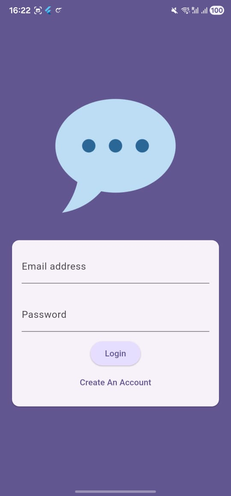
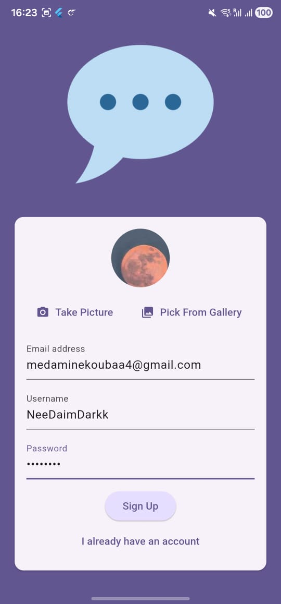
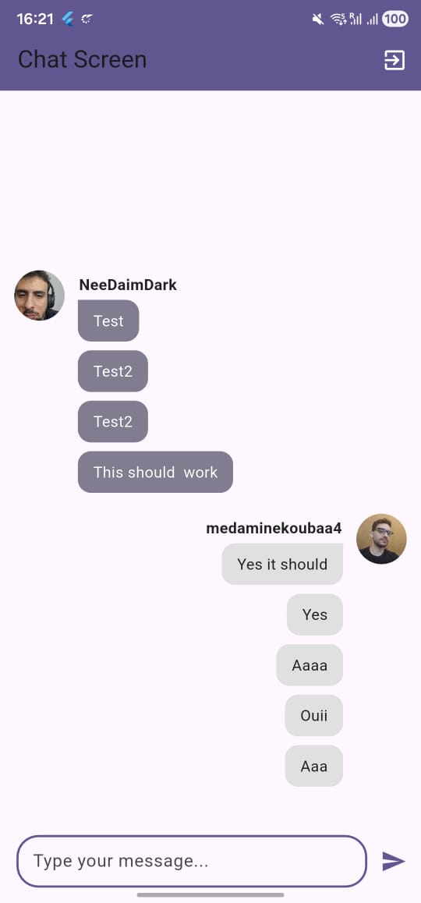

# Flutter Chat App

A production‑ready, Firebase‑backed chat application built with Flutter. Users can sign up, upload a profile image, authenticate with email/password, and exchange messages in real time with push notifications.

## Features
- Email/password authentication (Firebase Auth)
- Create account with username and profile photo (Firebase Storage)
- Real‑time messaging (Cloud Firestore)
- Push notifications for new messages (Firebase Cloud Messaging + Cloud Functions v2)
- Responsive UI, form validation, and error handling
- Simple theming and login state management

## Tech Stack
- Flutter (Dart)
- Firebase Core
- Firebase Authentication
- Cloud Firestore
- Firebase Storage
- Firebase Cloud Messaging (FCM)
- Firebase Cloud Functions v2 (Node.js 22)
- image_picker for camera/gallery avatar selection

## Project Structure (high level)
- lib/
  - main.dart, screens/, widgets/
- functions/
  - index.js (FCM notifications trigger), package.json
- android/, ios/, web/, macos/, windows/, linux/
- assets/images/

## Getting Started
1) Prerequisites
- Flutter SDK installed
- Node.js 22+ for Cloud Functions
- A Firebase project (Project ID already referenced in firebase.json)

2) Configure Firebase apps
- Android: add android/app/google-services.json
- iOS: add ios/Runner/GoogleService-Info.plist
- If you change Firebase apps, regenerate lib/firebase_options.dart via: flutterfire configure

3) Enable Firebase products in Console
- Authentication: Email/Password
- Firestore: create a database (choose a region; keep function region compatible)
- Storage: create a default bucket
- Cloud Messaging: set up FCM (for iOS also configure APNs)

4) Local run
- flutter pub get
- flutter run

## Cloud Functions (Notifications)
A Firestore onCreate trigger sends an FCM notification to topic "chat" when a new message is created in collection chat/.

Region note: Make sure the function region matches your Firestore location (e.g., europe‑west1 if Firestore is in eur3). After first‑time enablement of required APIs, wait a few minutes for permissions to propagate before deploying.

Common deploy commands
- Deploy only functions: firebase deploy --only functions
- Delete a wrongly‑deployed function: firebase functions:delete myFunction --region <region> -f

## Milestones (from commit history)
- push notification firebase
- displaying messages
- saving messages to firestore
- adding user to firestore with username
- upload image on firebase
- manage screens via login state
- logging in the user via firebase
- signing up the user via firebase
- signin signup + firebase set up
- initiate project
- first commit

## Screenshots
These images are stored under assets/screenshots and referenced relatively so GitHub can render them.

- 
- 
- 

## License
MIT (or your preferred license)
